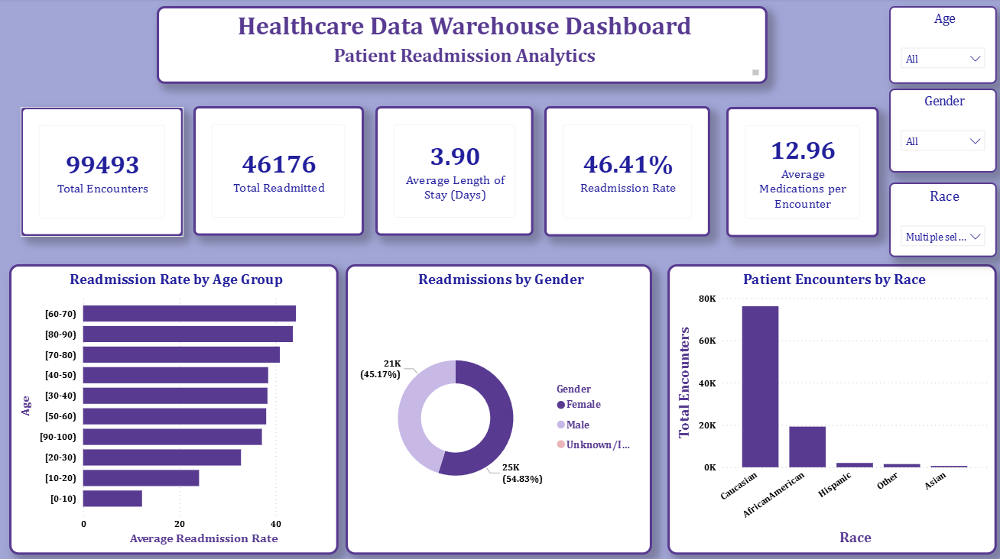
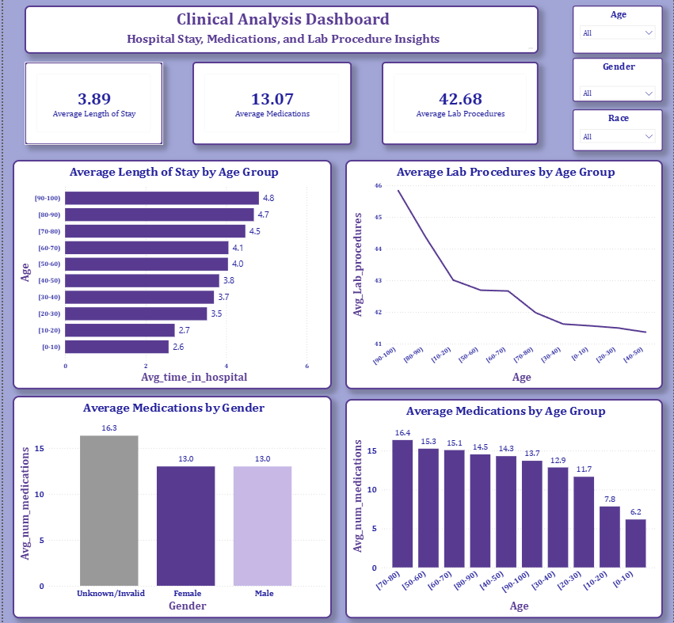
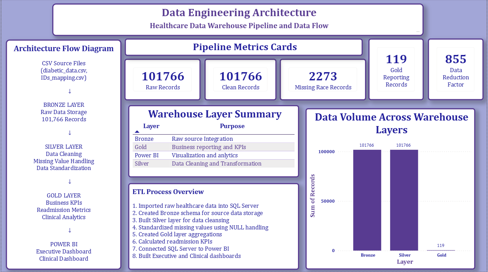

# Healthcare Data Engineering Pipeline

## Project Overview

This project demonstrates an end-to-end Healthcare Data Engineering Pipeline using SQL Server, Data Warehousing concepts, ETL transformations, and Power BI.

The objective is to transform raw healthcare readmission data into a structured reporting layer using a Bronze-Silver-Gold architecture and build interactive dashboards for business and clinical analytics.

---

## Business Problem

Hospital readmissions are a major challenge for healthcare organizations. Understanding patient demographics, hospitalization patterns, medication usage, and clinical procedures can help identify factors associated with readmission risk.

This project builds a scalable healthcare data warehouse and reporting solution to support data-driven decision making.

---

## Dataset

### Source

UCI Diabetes 130-US Hospitals Dataset

### Files Used

* diabetic_data.csv
* IDs_mapping.csv

### Records

* Raw Records: 101,766
* Patients: 71,518+
* Hospital Encounters: 101,766

---

## Technology Stack

### Data Engineering

* SQL Server Express
* SQL Server Management Studio (SSMS)
* Data Warehousing
* ETL Design

### Analytics & Visualization

* Power BI Desktop

### Version Control

* Git
* GitHub

---

## Data Warehouse Architecture

Source Files

↓
Bronze Layer (Raw Data)

↓
Silver Layer (Cleaned Data)

↓
Gold Layer (Business Reporting)

↓
Power BI Dashboards

### Bronze Layer

Purpose:

* Store raw source data
* Preserve original records
* Enable traceability

Tables:

* bronze.diabetic_data
* bronze.ids_mapping

### Silver Layer

Purpose:

* Data cleansing
* Missing value handling
* Standardization

Tables:

* silver.diabetic_clean

### Gold Layer

Purpose:

* Business reporting
* KPI generation
* Dashboard consumption

Tables:

* gold.readmission_summary

Views:

* gold.vw_readmission_summary

---

## ETL Process

### Step 1

Imported raw healthcare data into SQL Server.

### Step 2

Created Bronze schema for source data storage.

### Step 3

Loaded raw diabetic encounter data.

### Step 4

Built Silver layer for data cleansing and standardization.

### Step 5

Handled missing values and improved data quality.

### Step 6

Created Gold layer aggregations.

### Step 7

Calculated healthcare KPIs.

### Step 8

Connected SQL Server to Power BI.

### Step 9

Built Executive, Clinical, and Architecture dashboards.

---

## Data Quality Improvements

### Missing Race Values Identified

* 2,273 records

### Data Reduction

* Raw Records: 101,766
* Gold Reporting Records: 119

### Reduction Factor

* 855x

---

## Power BI Dashboards

### Page 1 – Executive Overview

KPIs:

* Total Encounters
* Total Readmitted Patients
* Readmission Rate
* Average Length of Stay
* Average Medications per Encounter

Visualizations:

* Readmission Rate by Age Group
* Readmissions by Gender
* Patient Encounters by Race

---

### Page 2 – Clinical Analysis

KPIs:

* Average Length of Stay
* Average Medications
* Average Lab Procedures

Visualizations:

* Average Length of Stay by Age Group
* Average Medications by Age Group
* Average Lab Procedures by Age Group
* Average Medications by Gender

---

## PowerBI Dashboard

---

### Page 3 – Data Engineering Architecture

Components:

* Pipeline Architecture Diagram
* Pipeline Metrics
* Warehouse Layer Summary
* ETL Process Overview
* Data Volume Analysis

---

## Key Insights

### Readmission Rate

* Overall readmission rate is approximately 46%.

### Age Trends

* Older age groups show higher readmission rates.

### Medication Burden

* Patients with higher medication counts tend to have higher healthcare utilization.

### Clinical Activity

* Lab procedures and hospitalization duration increase with patient complexity.

### Data Engineering Insight

* Successfully transformed over 100K raw records into a compact reporting layer through ETL and aggregation processes.

---

## Project Structure

healthcare-data-engineering-pipeline/

├── data/

│ └── raw/

│ ├── diabetic_data.csv

│ └── IDs_mapping.csv

│

├── sql/

│ ├── 01_create_schemas.sql

│ ├── 02_bronze_layer.sql

│ ├── 03_load_silver_layer.sql

│ ├── 04_gold_layer.sql

│ └── 05_reporting_views.sql

│

├── powerbi/

│ ├── pbix/

│ │ └── HealthcareDW_Dashboard.pbix

│ │

│ └── screenshots/

│ ├── executive_overview.png

│ ├── clinical_analysis.png

│ └── data_engineering_architecture.png

│

├── README.md

└── .gitignore

---

## Skills Demonstrated

* SQL Server
* Data Warehousing
* ETL Development
* Bronze-Silver-Gold Architecture
* Data Modeling
* Data Quality Management
* Healthcare Analytics
* KPI Development
* Power BI Dashboard Design
* Business Intelligence
* GitHub Project Management

---

## Future Enhancements

* Implement Azure Data Factory pipelines
* Migrate warehouse to Azure SQL Database
* Automate ETL workflows
* Add patient risk prediction models
* Deploy dashboards to Power BI Service

---

## Author

Humera Anjum

Healthcare Analytics | Data Analytics | Data Engineering | Business Intelligence

GitHub: https://github.com/HumsShaik/

LinkedIn: www.linkedin.com/in/humera-anjum-98273a209

---

⭐ If you found this project useful, please consider giving the repository a star.
